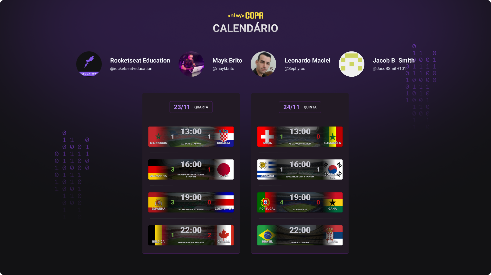

<h1 align="center"> FIFA World Cup Calendar (NLW #10 Copa) </h1>

Uma página de calendário da copa do mundo 2022 desenvolvido com suporte da @rocketseat-education no módulo Explorer do evento Next Level Week 10 - Copa

  <a href="#-tecnologias">Tecnologias</a>&nbsp;&nbsp;&nbsp;|&nbsp;&nbsp;&nbsp;
  <a href="#-projeto">Projeto</a>&nbsp;&nbsp;&nbsp;|&nbsp;&nbsp;&nbsp;
  <a href="#-layout">Layout</a>&nbsp;&nbsp;&nbsp;|&nbsp;&nbsp;&nbsp;
  <a href="#memo-licença">Licença</a>

  

 

  

## 🚀 Tecnologias

Esse projeto foi desenvolvido com as seguintes tecnologias:

- HTML e CSS
- JavaScript
- Git e Github

## 💻 Projeto

O Calendário da Copa é um projeto que mostra os jogos da Copa de 2022.

## 🔖 Layout

Você pode visualizar o layout do projeto através [DESSE LINK](https://www.figma.com/file/YV3uDy7MMOk5xLgBK6sXrJ/FWC2022Calendar/duplicate). É necessário ter conta no [Figma](https://figma.com) para acessá-lo.

## :memo: Licença

Esse projeto está sob a licença MIT.

---

Inspirado no projeto feito com ♥ by Rocketseat :wave: [Participe da comunidade da Rocketseat no discord!](https://discord.gg/rocketseat)
